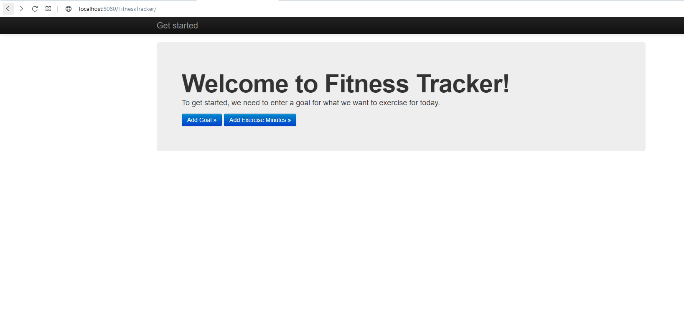
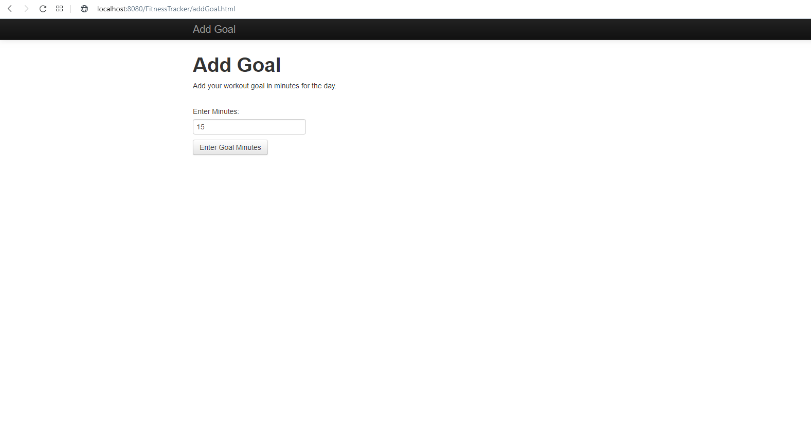
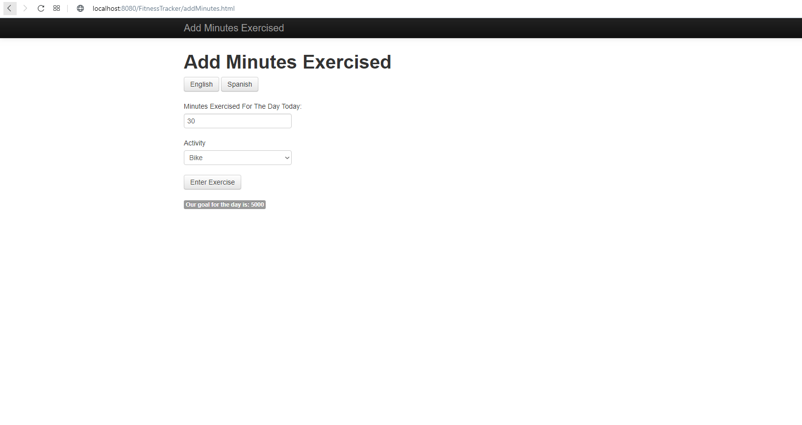
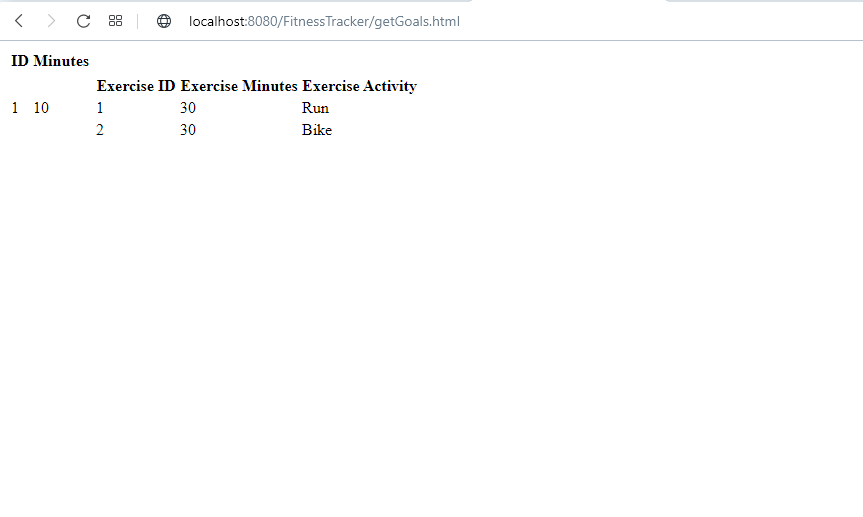
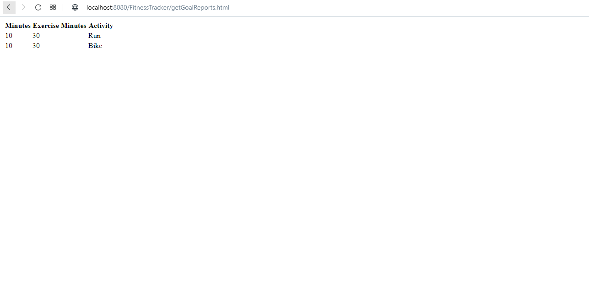
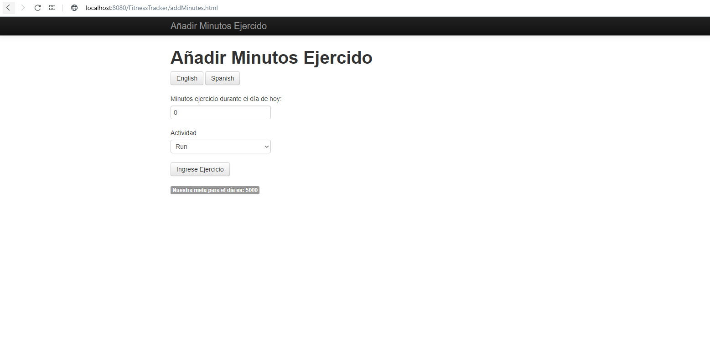
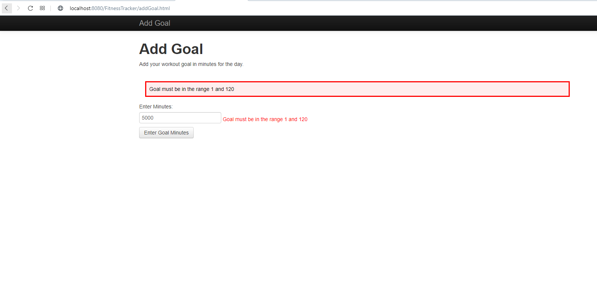
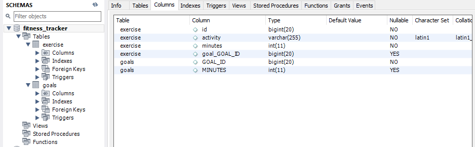
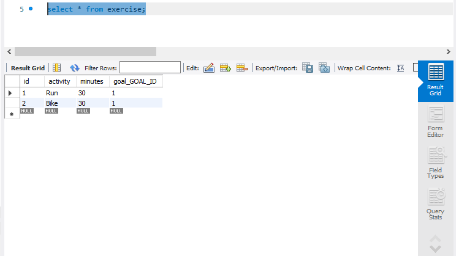

Requirements to run:
- Java 7
- Maven 3+
- Tomcat: v7.0.961
- MySQL:
    - MySQL Server v5.7.28
    - MySQL Workbench v8.0.18
    - ConnectorJ v8.0.18
    
This project was created by following the "Spring with JPA and Hibernate" course on PluralSight.

This is an expansion of the [FitnessTracker](https://github.com/DominikZig/FitnessTracker) application, adding persistence through Spring Data JPA and Hibernate. 
It is also expanded upon by using Bootstrap and Jetstrap for styling.

**Functionality:**

This project allows you to track your fitness goals by entering a goal in minutes. You can then enter how many minutes you exercised for today and which activity you did (out of a choice of running, biking or swimming).
You can also see a report of your specific goal, as well as a report of how you are tracking towards that goal.

**Technical Info:**

The project uses Java (specifically Spring Framework, Spring MVC and Spring Data JPA), Hibernate and MySQL for backend and JSP/HTML, Bootstrap and jQuery for frontend. It follows a Model View Controller architecture as well as 
having a Service tier for business logic and Repository tier for interacting with the database through JPA/Hibernate. Maven is used for dependency management, Tomcat is used as the application server and MySQL is used as the relational database for persistence.

The frontend is displayed through JSP/HTML and Bootstrap and the backend consists of a REST API and Spring Data JPA/Hibernate to interact with the MySQL database. The project also has some advanced features, such as localisation (having Spanish language support), 
validation (both for user input and database structure) and logging.

**Screenshots:**

Home page:

Add Goal page:

Add Minutes page:

Get Goals page:

Goals Report page:

Localisation support example:

Validation example:

Database example (must manually create "fitness_tracker" Schema first, but JPA/Hibernate creates the tables and columns through the application itself):

Persistence example:

